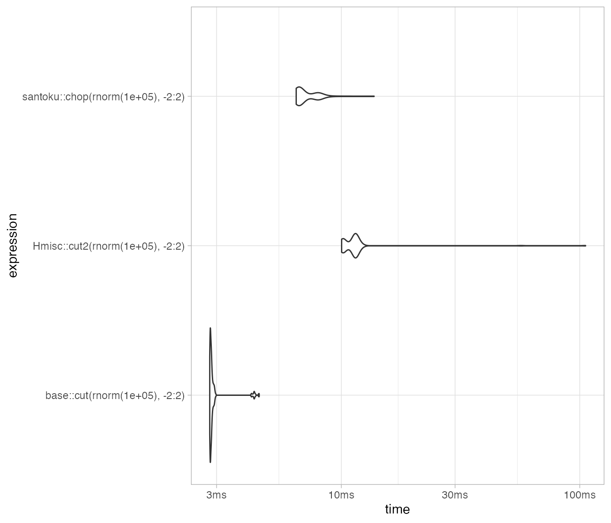
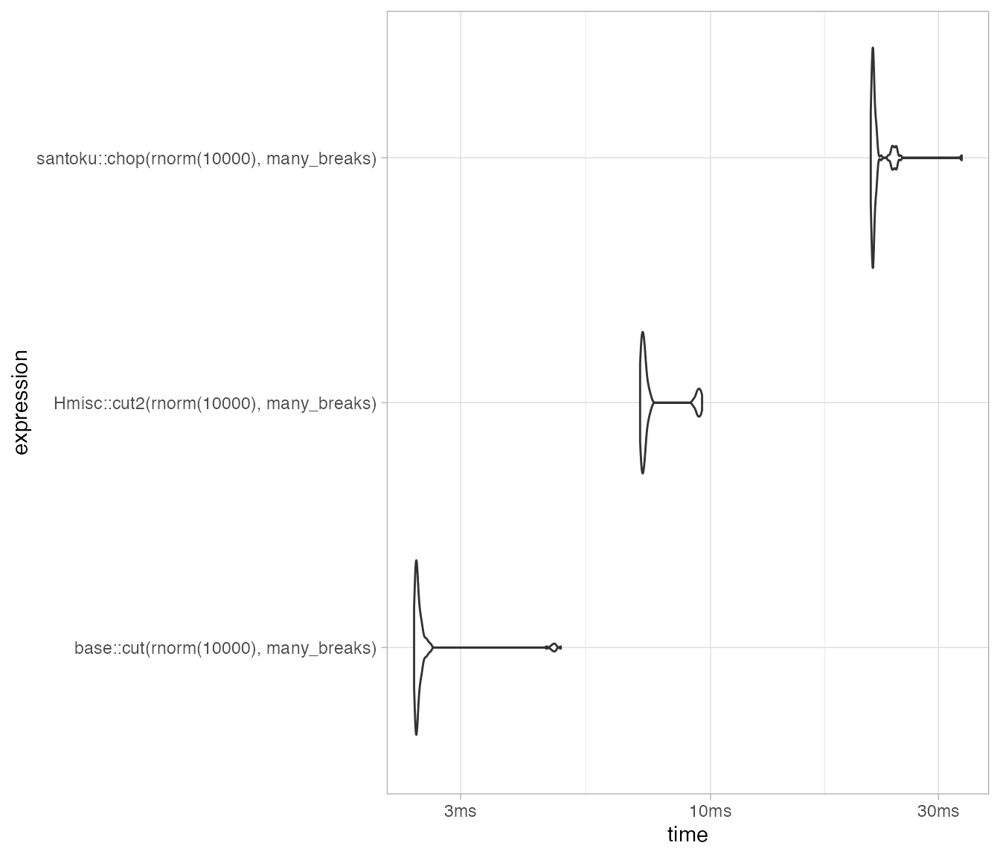
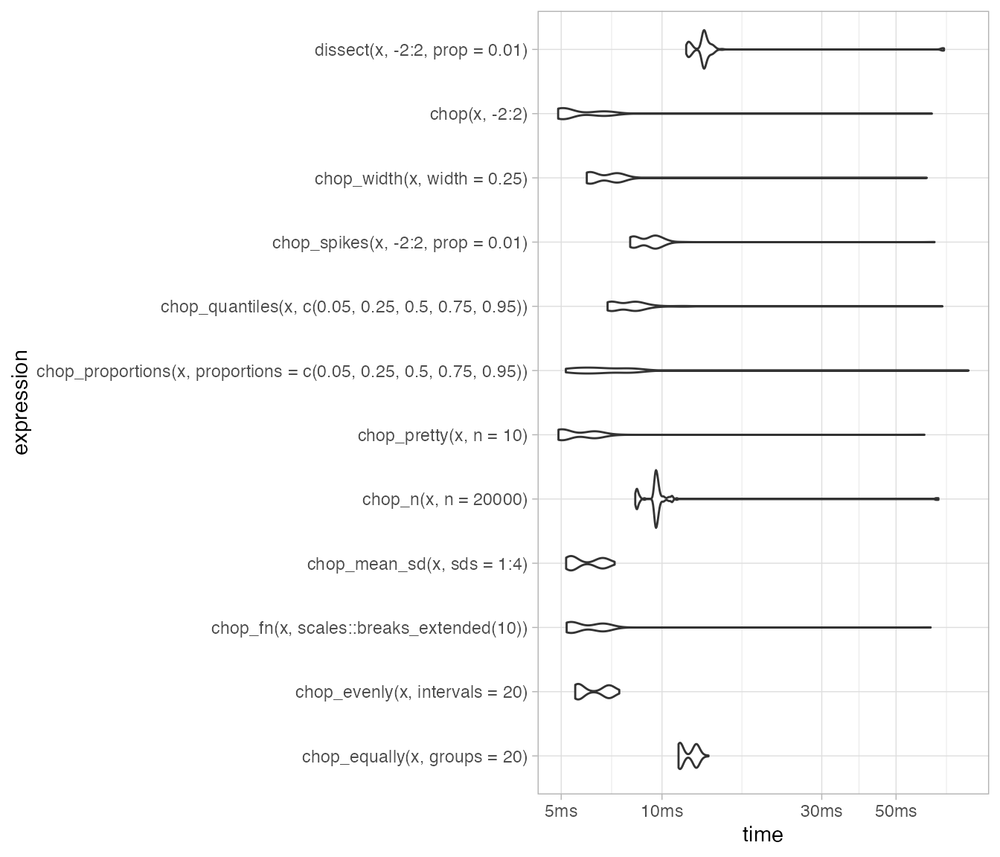

# Performance

## Speed

The core of santoku is written in C++. It is reasonably fast:

``` r

packageVersion("santoku")
#> [1] '2.0.0'
set.seed(27101975)

mb <- bench::mark(min_iterations = 100, check = FALSE,
        santoku::chop(rnorm(1e5), -2:2),
        base::cut(rnorm(1e5), -2:2),
        Hmisc::cut2(rnorm(1e5), -2:2)
      )
mb
#> # A tibble: 3 × 6
#>   expression                            min  median `itr/sec` mem_alloc `gc/sec`
#>   <bch:expr>                        <bch:t> <bch:t>     <dbl> <bch:byt>    <dbl>
#> 1 santoku::chop(rnorm(1e+05), -2:2)  6.47ms  6.64ms     149.    10.25MB     63.9
#> 2 base::cut(rnorm(1e+05), -2:2)      2.81ms  2.84ms     351.     2.35MB     24.3
#> 3 Hmisc::cut2(rnorm(1e+05), -2:2)   10.03ms 10.16ms      98.2    19.5MB    199.
```

``` r
autoplot(mb, type = "violin")
```



## Many breaks

``` r

many_breaks <- seq(-2, 2, 0.001)

mb_breaks <- bench::mark(min_iterations = 100, check = FALSE,
        santoku::chop(rnorm(1e4), many_breaks),
        base::cut(rnorm(1e4), many_breaks),
        Hmisc::cut2(rnorm(1e4), many_breaks)
      )

mb_breaks
#> # A tibble: 3 × 6
#>   expression                            min  median `itr/sec` mem_alloc `gc/sec`
#>   <bch:expr>                        <bch:t> <bch:t>     <dbl> <bch:byt>    <dbl>
#> 1 santoku::chop(rnorm(10000), many… 21.64ms  21.9ms      45.5    5.14MB     8.03
#> 2 base::cut(rnorm(10000), many_bre…   2.4ms  2.43ms     408.     1.39MB    19.7 
#> 3 Hmisc::cut2(rnorm(10000), many_b…  7.12ms  7.24ms     138.      5.7MB    28.2
```

``` r
autoplot(mb_breaks, type = "violin")
```



## Various chops

``` r

x <- c(rnorm(9e4), sample(-2:2, 1e4, replace = TRUE))

mb_various <- bench::mark(min_iterations = 100, check = FALSE,
        chop(x, -2:2),
        chop_equally(x, groups = 20),
        chop_n(x, n = 2e4),
        chop_quantiles(x, c(0.05, 0.25, 0.5, 0.75, 0.95)),
        chop_evenly(x, intervals = 20),
        chop_width(x, width = 0.25),
        chop_proportions(x, proportions = c(0.05, 0.25, 0.5, 0.75, 0.95)),
        chop_mean_sd(x, sds = 1:4),
        chop_fn(x, scales::breaks_extended(10)),
        chop_pretty(x, n = 10),
        chop_spikes(x, -2:2, prop = 0.01),
        dissect(x, -2:2, prop = 0.01)
      )
      
mb_various
#> # A tibble: 12 × 6
#>    expression                           min  median `itr/sec` mem_alloc `gc/sec`
#>    <bch:expr>                       <bch:t> <bch:t>     <dbl> <bch:byt>    <dbl>
#>  1 chop(x, -2:2)                      4.9ms  5.03ms     197.     8.63MB     97.2
#>  2 chop_equally(x, groups = 20)      11.2ms 11.31ms      88.1   12.18MB     84.6
#>  3 chop_n(x, n = 20000)              8.32ms  8.42ms     118.     23.5MB    520. 
#>  4 chop_quantiles(x, c(0.05, 0.25,…  6.88ms   7.1ms     133.    12.09MB    118. 
#>  5 chop_evenly(x, intervals = 20)    5.51ms  5.62ms     178.    12.48MB    158. 
#>  6 chop_width(x, width = 0.25)       5.96ms  6.08ms     163.    12.54MB    145. 
#>  7 chop_proportions(x, proportions…  5.16ms  5.86ms     168.    12.48MB    143. 
#>  8 chop_mean_sd(x, sds = 1:4)        5.17ms  5.34ms     187.    11.38MB    147. 
#>  9 chop_fn(x, scales::breaks_exten…  5.19ms  5.35ms     186.    11.47MB    146. 
#> 10 chop_pretty(x, n = 10)            4.91ms  5.01ms     198.    10.58MB    138. 
#> 11 chop_spikes(x, -2:2, prop = 0.0…  8.04ms  8.23ms     121.    14.62MB    153. 
#> 12 dissect(x, -2:2, prop = 0.01)    11.81ms 12.01ms      82.7   22.27MB    251.
```

``` r
autoplot(mb_various, type = "violin")
```


